# Building a Controller - Writeup#

### 1. GenerateMotorCommands
Convert a desired 3-axis moment and collective thrust command to individual motor thrust commands

Contrary to the roll and pitch the yaw motion is executed by the mismatch of the moments generated by the propellers along the $z$ axis by the reactive force. The moment generated by the propeller is directed opposite of its rotation and is proportional to the square of the angular velocities.  


    τx=(F1+F4−F2−F3)l
    τy=(F1+F2−F3−F4)l
    τz=τ1+τ2+τ3+τ4  
    k_m/k_f = - kappa
    Fn = kappa * omega_n^2
    τ1 = k_m*omega1^2
    τ2 = -k_m*omega2^2
    τ3 = k_m*omega3^2
    τ4 = -k_m*omega4^2
``` c
  float l = L/sqrt(2);
  float a = collThrustCmd;
  float b = momentCmd.x/l;
  float c = momentCmd.y/l;
  float d = -momentCmd.z/kappa;

  float F1 = (a + b + c +d)/4;
  float F2 = (a + c )/2 - F1;
  float F3 = (a + b )/2 - F1;
  float F4 = a - F1 - F2 - F3;
  
  cmd.desiredThrustsN[0] = CONSTRAIN(F1, minMotorThrust, maxMotorThrust);
  cmd.desiredThrustsN[1] = CONSTRAIN(F2, minMotorThrust, maxMotorThrust);
  cmd.desiredThrustsN[2] = CONSTRAIN(F3, minMotorThrust, maxMotorThrust);
  cmd.desiredThrustsN[3] = CONSTRAIN(F4, minMotorThrust, maxMotorThrust);
```

### 2. BodyRateControl
Calculate a desired 3-axis moment given a desired and current body rate

The commanded roll, pitch, and yaw are collected by the body rate controller, and they are translated into the desired rotational accelerations along the axis in the body frame.

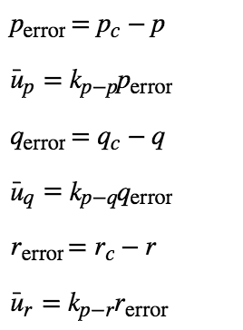

then return  `(Ixx, Iyy, Izz)*(u_bar_p, u_bar_q, u_bar_r)`

``` c
  float p_actual = pqr.x;
  float q_actual = pqr.y;
  float r_actual = pqr.z;
  float p_c = pqrCmd.x;
  float q_c = pqrCmd.y;
  float r_c = pqrCmd.z;
  float k_p_p = kpPQR.x;
  float k_p_q = kpPQR.y;
  float k_p_r = kpPQR.z;

  float p_err=p_c - p_actual;
  float u_bar_p = k_p_p * p_err;

  float q_err= q_c - q_actual;
  float u_bar_q = k_p_q * q_err;

  float r_err= r_c - r_actual;
  float u_bar_r = k_p_r * r_err;
  momentCmd = V3F(Ixx * u_bar_p, Iyy * u_bar_q, Izz * u_bar_r);

```

### 3. RollPitchControl

Calculate a desired pitch and roll angle rates based on a desired global lateral acceleration, the current attitude of the quad, and desired collective thrust command.

The roll-pitch controller is a P controller responsible for commanding the roll and pitch rates ( pcpc  and  qcqc ) in the body frame. First, it sets the desired rate of change of the given matrix elements using a P controller.

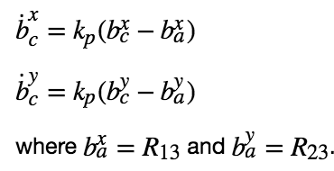

The given values can be converted into the angular velocities into the body frame by the next matrix multiplication.

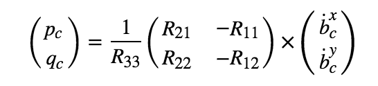

For the `b_x(y)_c_target`, use function `CONSTRAIN ()` to range between `(-maxTiltAngle, maxTiltAngle)`

``` c
  float a_c = -collThrustCmd / mass;
  
  float b_x = R(0, 2);
  float b_x_c_target = accelCmd.x / a_c;
  b_x_c_target = CONSTRAIN(b_x_c_target, -maxTiltAngle, maxTiltAngle);
  float b_x_err = b_x_c_target - b_x;
  float b_x_p_term = kpBank * b_x_err;
  
  float b_y = R(1, 2);
  float b_y_c_target = accelCmd.y / a_c;
  b_y_c_target = CONSTRAIN(b_y_c_target, -maxTiltAngle, maxTiltAngle);
  float b_y_err = b_y_c_target - b_y;
  float b_y_p_term = kpBank * b_y_err;

  pqrCmd.x = ( R(1,0) * b_x_p_term - R(0,0) * b_y_p_term/ R(2,2));
  pqrCmd.y = ( R(1,1) * b_x_p_term - R(0,1) * b_y_p_term / R(2,2));
```

### 4. AltitudeControl
Calculate desired quad thrust based on altitude setpoint, actual altitude, vertical velocity setpoint, actual vertical velocity, and a vertical acceleration feed-forward command.

Linear acceleration can be expressed by the next linear equation

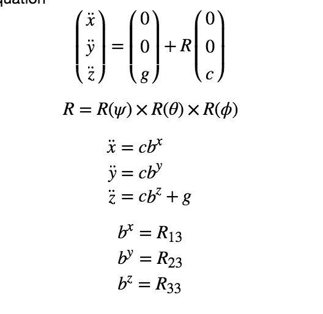

In this exercise a PD controller is used for the altitude which results in:

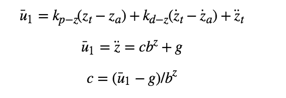

And I try to add a PID controller in the project but I can't find much different in the task.

``` c
  float z_err = posZCmd - posZ;
  float z_err_dot = velZCmd - velZ;
  float b_z = R(2,2);
  
  float p_term = kpPosZ * z_err;
  float d_term = kpVelZ * z_err_dot;
  
//  integratedAltitudeError += z_err *dt;
//  float i_term = integratedAltitudeError * KiPosZ;
//
//
//  float u_1_bar = p_term + d_term + i_term +  accelZCmd;
  float u_1_bar = p_term + d_term + accelZCmd;
  
  float c  = (u_1_bar - 9.81f)/b_z;
  thrust = - mass * CONSTRAIN(c, -maxAscentRate/dt, maxAscentRate/dt);
```

### 5. LateralPositionControl

Calculate a desired horizontal acceleration based on  desired lateral position/velocity/acceleration and current pose.

The lateral controller will use a PD controller to command target values for elements of the drone's rotation matrix. The drone generates lateral acceleration by changing the body orientation which results in non-zero thrust in the desired direction. This will translate into the commanded rotation matrix elements `b_x_c` and `b_y_c`. 

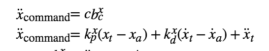

For the  y  direction the control equations will have the same form as above, `(k_p,k_d) = (kpPosXY, kpVelXY)`

Then in the code limit the maximum horizontal velocity and acceleration to maxSpeedXY and maxAccelXY

``` c
  
  if ( velCmd.mag() > maxSpeedXY ) {
    velCmd = velCmd.norm() * maxSpeedXY;
  }

  V3F err = posCmd - pos;
  V3F err_dot = velCmd - vel;
  float p_term_x =  kpPosXY * err.x;
  float d_term_x = kpVelXY * err_dot.x;
  float x_dot_dot_command = p_term_x + d_term_x + accelCmdFF.x;

  float p_term_y =  kpPosXY * err.y;
  float d_term_y = kpVelXY * err_dot.y;
  float y_dot_dot_command = p_term_y + d_term_y + accelCmdFF.y;

  accelCmd.x += x_dot_dot_command;
  accelCmd.y += y_dot_dot_command;

  if( accelCmd.mag() > maxSpeedXY) {
    accelCmd = accelCmd.norm() * maxAccelXY;
  }

```

### 6. YawControl

Calculate a desired yaw rate to control yaw to yawCmd

Control over yaw is decoupled from the other directions. A P controller is used to control the drone's yaw.

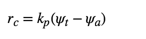


``` c
  float psi_err = yawCmd - yaw;
  yawRateCmd =  kpYaw * psi_err;I t
```

### 7. QuadControlParams

#### scenario 2
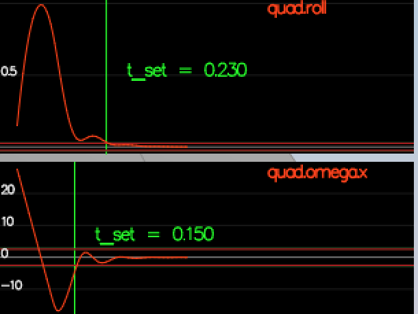

- I try to tune kpPQR from (23, 23, 5) to (100,100,10), the vehicle to stop spinning quickly but not overshoot.
- Then I tune kpBank from 5 to 15, and get a good result. 

### scenario 3 and scenario 4
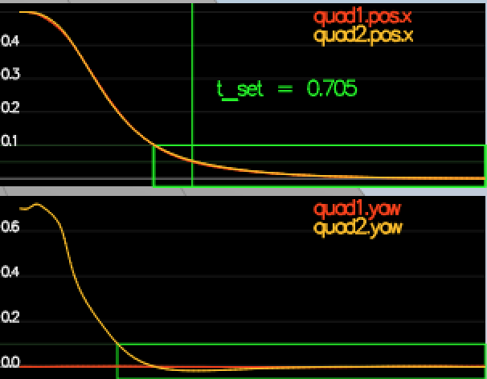

- yaw: 0 -> 4 
- the second pic more quickly to zero.

---

- kpPosXY, kpPosZ, KiPosZ: (1,1,20) -> (25,70,20)
- I find  kpPosXY, kpPosZ is useful, for a better result kpPosXY should increase but it can't be too high.

---

- kpVelXY,kpVelZ: (4,4) -> (10,15)
- kpVelXY between 4 ~ 8 can get a t_set less than 0.5, but it can't not fit the scenario 4 very well. And 10 I think is good for both 3 and 4 scenario.
- I try kpVelZ from  4 to 30. I think  between 10~20 is ok for a good result.

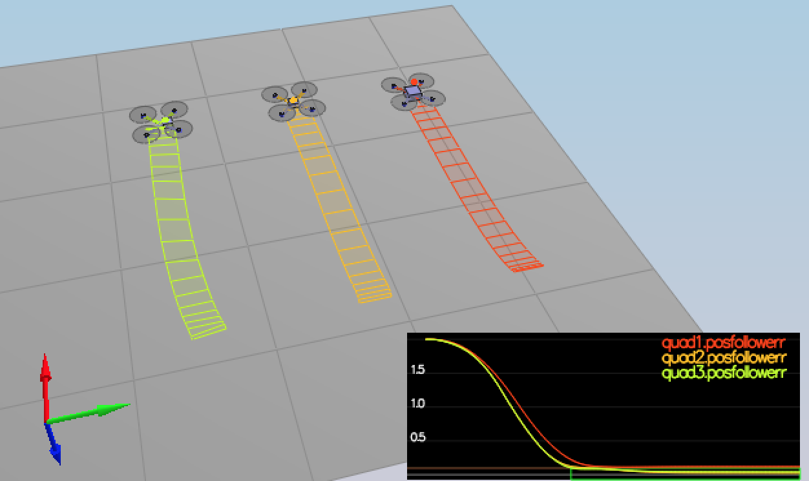

###  scenario 5

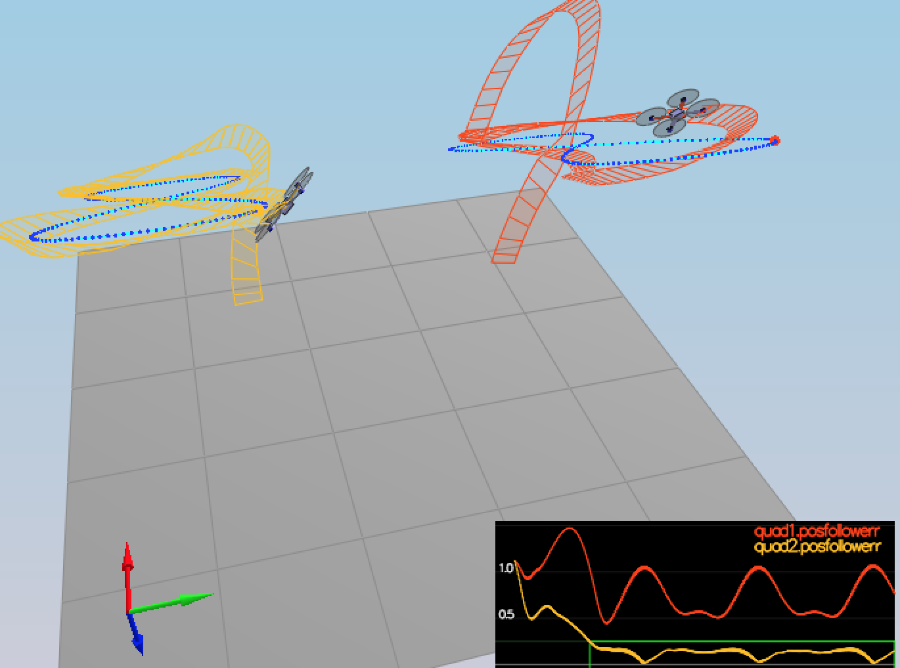

I didn't tune any params in scenario 5 at last. The left quadcopter perform well but I can't tune any params to make the right  quadcopter perform. I think it need more work to do.