# Building an Estimator - Writeup
## The Tasks
Once again, you will be building up your estimator in pieces. At each step, there will be a set of success criteria that will be displayed both in the plots and in the terminal output to help you along the way.
Project outline:

 - [1. Sensor Noise](pic/#step-1-sensor-noise)
 - [2. Attitude Estimation](pic/#step-2-attitude-estimation)
 - [3. Prediction Step](pic/#step-3-prediction-step)
 - [4. Magnetometer Update](pic/#step-4-magnetometer-update)
 - [5. Closed Loop + GPS Update](pic/#step-5-closed-loop--gps-update)
 - [6. Adding Your Controller](pic/#step-6-adding-your-controller)

### 1. Sensor Noise ###


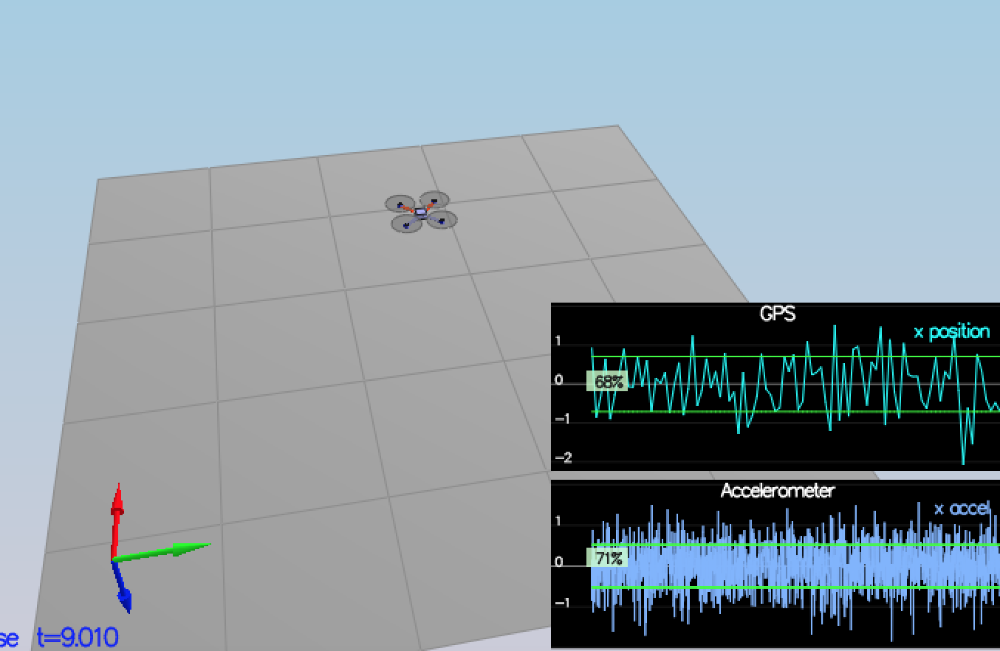
First time run the code,I open the Graph1.txt for GPSPosXY and  Graph2.txt for AccelXY.  Standard deviation for `(GPSPosXY, AccelXY)` is `(0.708961512,0.52060209)`.

Then I set params to `MeasuredStdDev_GPSPosXY = 0.71` and `MeasuredStdDev_AccelXY = .52` and pass the test.
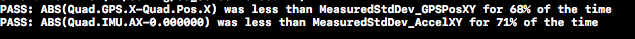

### 2. Attitude Estimation ###

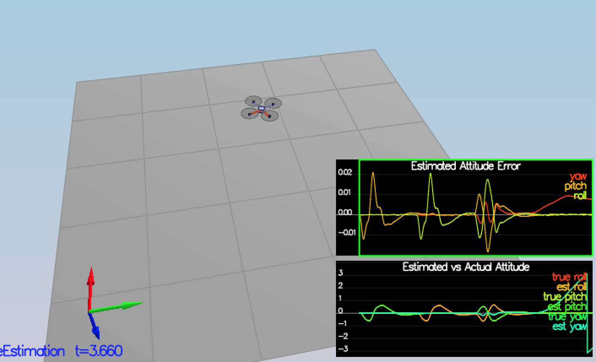

In `UpdateFromIMU()` function, improve a complementary filter-type attitude filter.Implement a better integration method that uses the current attitude estimate `(rollEst, pitchEst and ekfState(6))` to integrate the body rates into new Euler angles.


``` c
  Quaternion<float> attitude = Quaternion<float>::FromEuler123_RPY(rollEst, pitchEst, ekfState(6));
  attitude.IntegrateBodyRate(gyro, dtIMU);
  ekfState(6) = attitude.Yaw();
  float predictedPitch = attitude.Pitch();
  float predictedRoll = attitude.Roll();
  
  // normalize yaw to -pi .. pi
  if (ekfState(6) > F_PI) ekfState(6) -= 2.f*F_PI;
  if (ekfState(6) < -F_PI) ekfState(6) += 2.f*F_PI;
```
Use `FromEuler123_RPY` function for creating a quaternion from Euler Roll/PitchYaw, then use a IntegrateBodyRate function with quaternions 	`(gyro, dtIMU)` 

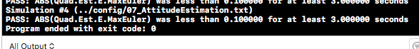

### 3. Prediction Step ###

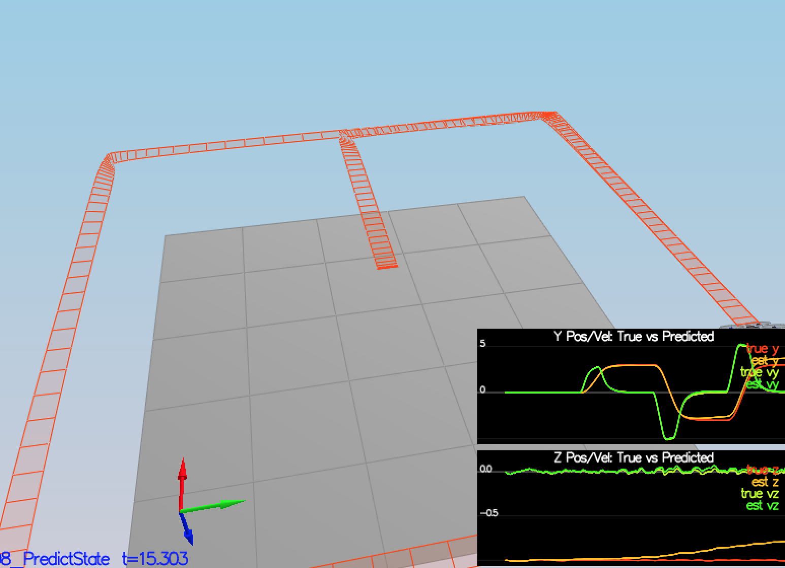

#### PredictState()
The transition function is:

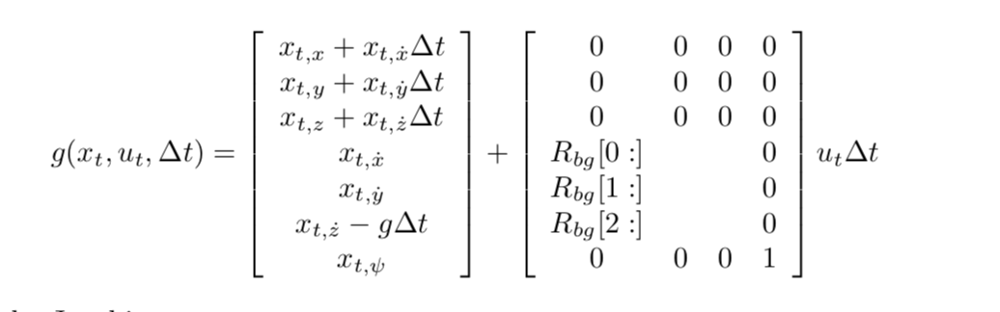

Predict the current state forward by time dt using current accelerations and body rates as input:

``` c
  V3F inertial = attitude.Rotate_BtoI(accel);
  predictedState(0) += curState(3)*dt;
  predictedState(1) += curState(4)*dt;
  predictedState(2) += curState(5)*dt;
  predictedState(3) += inertial.x * dt;
  predictedState(4) += inertial.y * dt;
  predictedState(5) += inertial.z * dt - 9.81f * dt;
```

#### GetRbgPrime()
The partial derivative of the Rbg rotation matrix with respect to yaw:

 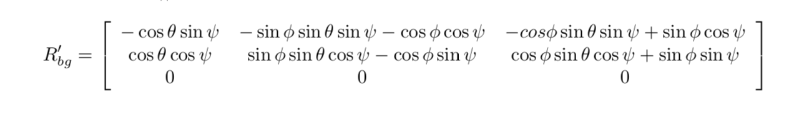
 
 ``` c
  float phi = roll;    //ϕ
  float theta = pitch; //θ
  float psi = yaw;     //ψ
  
  
  RbgPrime(0, 0) = - cos(theta) * sin(psi);
  RbgPrime(0, 1) = - sin(phi)   * sin(psi) * sin(theta) - cos(phi) * cos(psi);
  RbgPrime(0, 2) = - cos(phi)  * sin(theta)* sin(psi)   + sin(phi) * cos(psi);
  
  
  RbgPrime(1, 0) = cos(theta) * cos(psi);
  RbgPrime(1, 1) = sin(phi) * sin(theta) * cos(psi) - cos(phi) * sin(psi);
  RbgPrime(1, 2) = cos(phi) * sin(theta) * cos(psi) + sin(phi) * sin(psi);
 ```

#### Predict()
The transition function  take the Jacobian:

 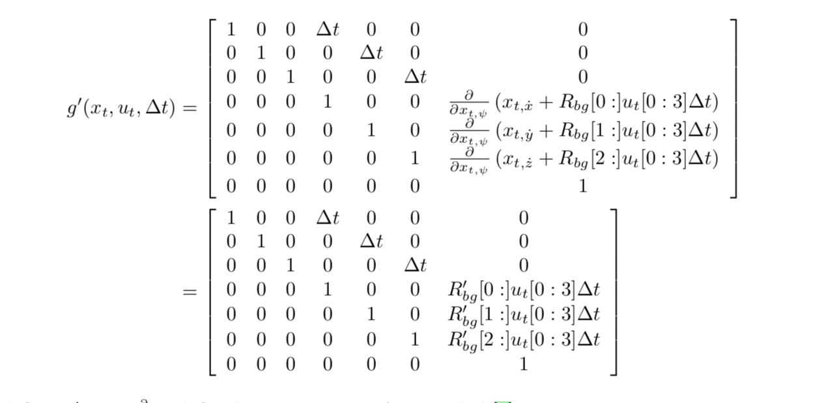
 
 ``` c
  gPrime(0,3) = dt;
  gPrime(1,4) = dt;
  gPrime(2,5) = dt;
  gPrime(3,6) = (RbgPrime(0,0) * accel.x + RbgPrime(0,1) * accel.y + RbgPrime(0,2) * accel.z) * dt;
  gPrime(4,6) = (RbgPrime(0,0) * accel.x + RbgPrime(0,1) * accel.y + RbgPrime(0,2) * accel.z) * dt;
  gPrime(5,6) = (RbgPrime(0,0) * accel.x + RbgPrime(0,1) * accel.y + RbgPrime(0,2) * accel.z) * dt;
  
  MatrixXf gPrimeT = gPrime.transpose();
  ekfCov = gPrime * (ekfCov * gPrimeT) + Q ;
 ```

#### Predict Covariance

Run covariance prediction and tune the `QPosXYStd` and the `QVelXYStd` process parameters in `QuadEstimatorEKF.txt` to capture the magnitude of the error.

 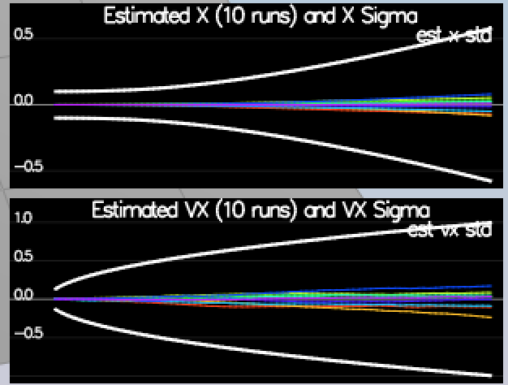
 
 I tune params to a good result when `(QPosXYStd, QVelXYStd)` = `(0.05, 1.0)`
 
### 4. Magnetometer Update ###
Get a reading from the magnetometer reporting yaw in the global frame. This measurement may need to be computed using roll and pitch from the attitude filter and the mag vector.


 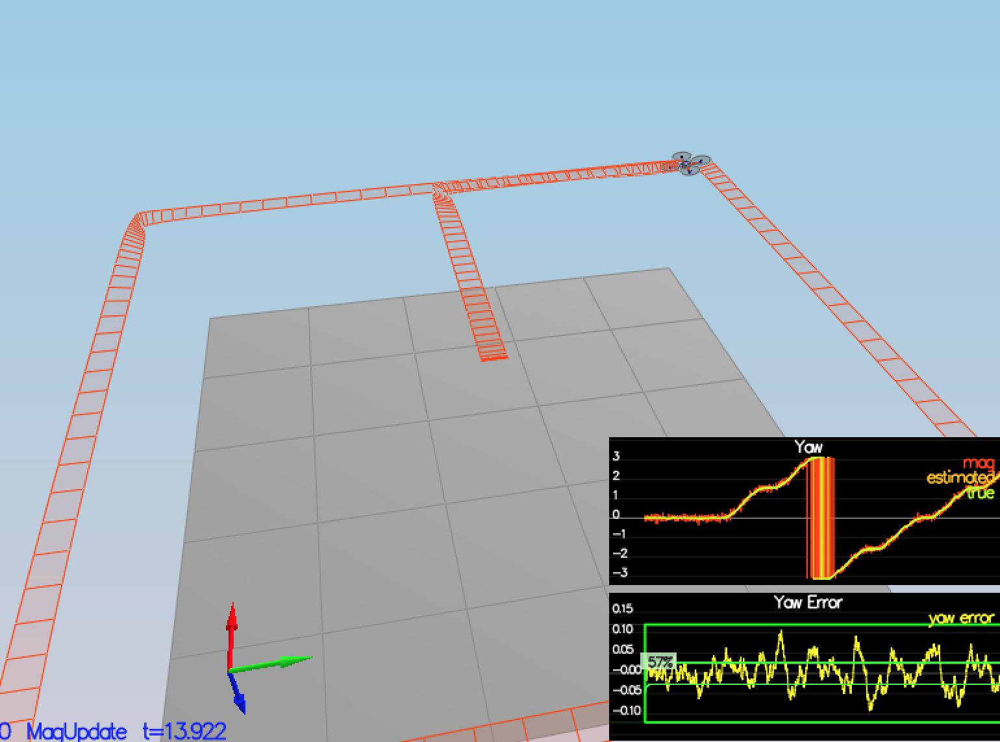

#### UpdateFromMag()

Since this is linear, the derivative is a matrix of zeros and ones.

 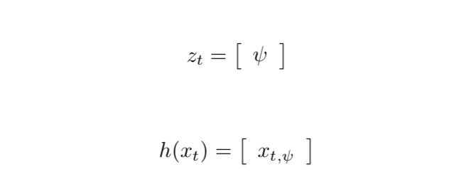
 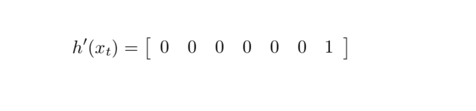
 
 In the code normalize the difference between your measured and estimated yaw
 
 ``` c
  hPrime(0,6) = 1; //derivative
  zFromX(0) = ekfState(6); //current estimated yaw
  float diffyaw = z(0) - zFromX(0);
  if (diffyaw > F_PI)  z(0)  -= 2.f*F_PI;
  if (diffyaw < -F_PI) z(0)  += 2.f*F_PI;
 ```

#### Parameters
Tune the parameter `QYawStd`  so that it approximately captures the magnitude of the drift.

When I increase `QYawStd` to `0.07` I get a good result pass the test.

 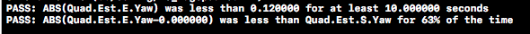

### 5. Closed Loop + GPS Update ###
 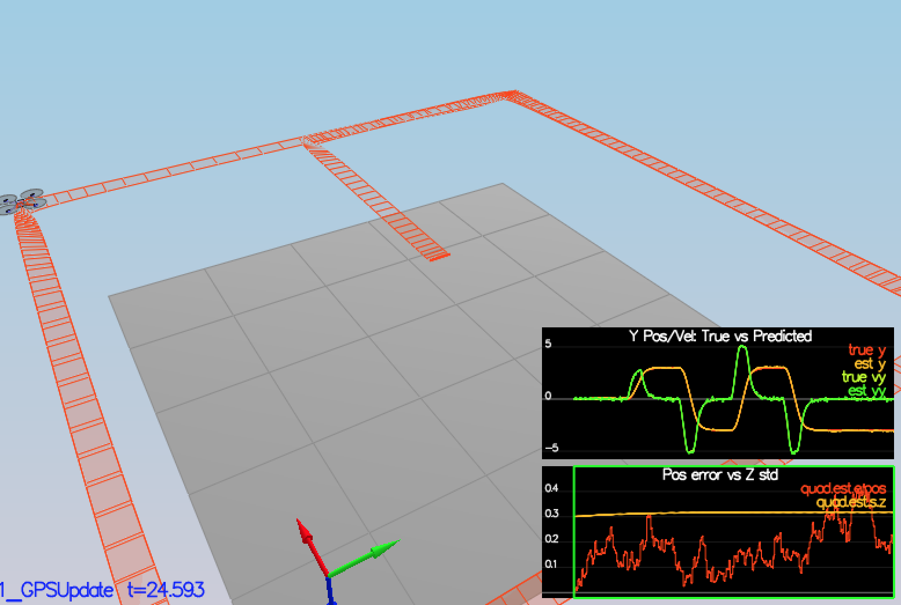


Hence we are removing it from the observation.
 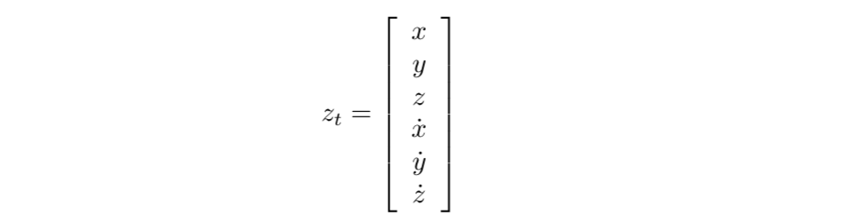

The measurement model is:

 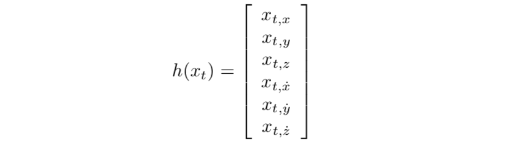
 
The partial derivative is the identity matrix, augmented with a vector of zeros for

 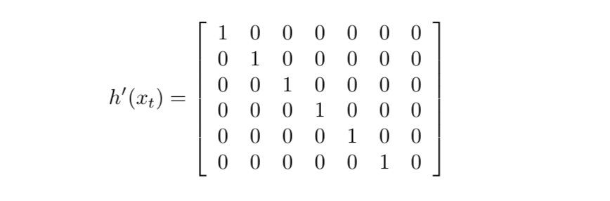
 
The GPS measurement covariance is available in member variable R_GPS

 ``` c
   int i = 0;
   while(i < 6) {
    hPrime(i,i) = 1;
    zFromX(i) = ekfState(i);
    ++i;
  }
  
 ```
 
### 6. Adding Your Controller ###


- Replace `QuadController.cpp` with the controller you wrote in the last project.

- Replace `QuadControlParams.txt` with the control parameters you came up with in the last project. 

- I didn't pass the test at first, after I tune the params:

`parameter = newValue(last project value)`

```
Mass = 0.5(0.4)
kpVelXY = 12(10)
kpPQR = 100, 100, 5(100,100,10)
kpBank = 15(10)
kpYaw = 4(2)

```
